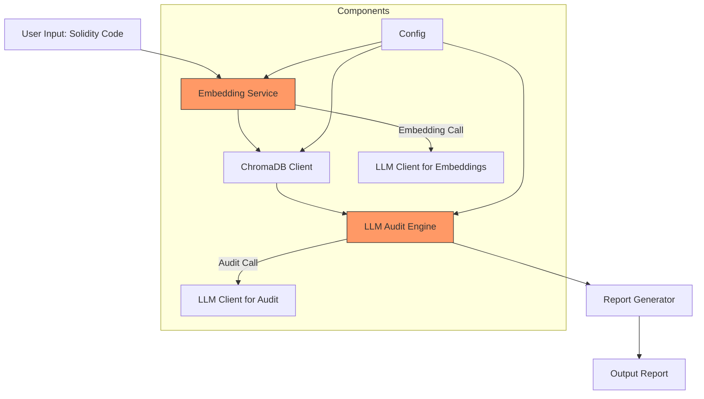

# LLM Call Chain Blueprint for SolidGuard

## 1. Executive Summary

This blueprint reviews and redesigns the LLM call chain in the SolidGuard Solidity smart contract audit platform. The current architecture uses LLM clients, embedding services, and ChromaDB for context retrieval, but suffers from critical issues such as lack of retry mechanisms, unbounded LLM calls, and runtime errors. The proposed architecture introduces robust retry patterns, rate limiting, input validation, and cost controls to enhance reliability, security, and efficiency. Prioritized implementation focuses on addressing critical issues first to ensure system stability.

## 2. Current Architecture

The current call flow involves sequential interactions between components, with potential failure points at each stage.



**Current Call Flow:**
1. Solidity code is processed by the embedding service to generate vector embeddings.
2. Embeddings are stored or queried in ChromaDB for relevant context.
3. The LLM audit engine uses this context to perform security analysis.
4. Findings are compiled by the report generator.

## 3. Issue Registry

11 issues identified during review, categorized by severity.

### CRITICAL

1. **No Retry in Embedding Service (`embedding.py`)**: Single point of failure with no retry logic for API calls.
2. **Unbounded LLM Calls in Audit (`llm_audit.py`)**: `polish_with_llm` sends all findings at once, risking token limits and high costs.
3. **Unbounded LLM Calls**: No limits on concurrent or sequential LLM calls, leading to potential overload.

### HIGH

4. **Environment Variables Crash at Runtime (`config.py`)**: Missing or invalid env vars cause immediate crashes.
5. **Dead Injection Patterns**: Prompt injection checks are implemented but not integrated, rendering them ineffective.
6. **Short Timeouts**: Default timeouts are too short for LLM responses, causing failures.
7. **No Rate Limiting for Embedding**: Embedding API calls lack rate limiting, risking service bans.
8. **Embedding Response Not Validated**: No checks on embedding API responses, leading to silent errors.  
### MEDIUM  
  
9. **Character vs Token Truncation (`llm_audit.py`)**: `_sanitize_source_code` truncates by characters (8000), not tokens, potentially causing context loss or overflow.  
10. **Embedding Context Loss (`llm_audit.py`)**: Function bodies are embedded separately from contract context, losing important contract-level information.  
11. **Summary Unvalidated (`llm_audit.py`)**: Contract summaries generated by LLM are not validated for completeness or correctness.  
12. **ChromaDB Fallback Bias (`chroma_client.py`)**: No fallback logic for ChromaDB failures; empty results returned silently.  
13. **Greedy Regex (`llm_audit.py`)**: \[.*\] pattern in `_parse_llm_json` uses greedy matching, potentially capturing incorrect JSON boundaries.  
14. **Overly Broad Exceptions**: Multiple `except Exception` blocks mask specific errors, hindering debugging.  
15. **No HTTPX Connection Reuse**: Each LLM/embedding call creates a new httpx client, increasing connection overhead.  
16. **Incomplete Retry Coverage**: Only `chat_completion` has retry logic; embedding and ChromaDB calls lack retries. 
  
---  
  
## 4. Proposed Architecture  
  
Enhanced architecture with retry mechanisms, rate limiting, and chunking for improved resilience and cost control.  
  
```mermaid  
flowchart TD  
    A[User Input: Solidity Code] -- Validation & Sanitization]  
    B -- Limiter]  
    C -- Service]  
    D -- Client]  
    E -- Audit Engine]  
    F -- Generator]  
    G -- Report]  
  
    subgraph Resilience Layer  
        R1[Retry with Exponential Backoff]  
        R2[Circuit Breaker]  
        R3[Token Budget Manager]  
        R4[Rate Limiter]  
    end  
  
    R1 -- 
    R1 -- 
    R1 -- 
    R4 -- 
    R4 -- 
    B -- Sanitizer]  
    D -- Validator]  
    B -- Detector]  
  
    style B fill:#90EE90,stroke:#333  
    style R1 fill:#FFD700,stroke:#333  
    style R4 fill:#FFD700,stroke:#333  
``` 
  
### Detailed Call Flow with Chunking  
  
```mermaid  
sequenceDiagram  
    participant U as User  
    participant IV as InputValidator  
    participant RL as RateLimiter  
    participant E as EmbeddingService  
    participant C as ChromaDB  
    participant LLM as LLMClient  
    participant RG as ReportGenerator  
  
    U- Submit Solidity Code  
    IV- Sanitize & Validate  
  
    loop For each function  
        IV- Request embedding  
        RL- Check rate limit  
        RL- get_embedding(body)  
        E- Retry with tenacity  
        E-- embedding vector  
  
        RL- query(embedding, top_k)  
        C-- vulnerability context  
  
        RL- audit_function(code, context)  
        LLM- Retry with tenacity  
        LLM- Validate JSON response  
        LLM-- findings[]  
    end  
  
    RL- generate_report(findings)  
    Note over RG: Chunk findings into batches  
    loop For each batch  
        RG- polish_with_llm(batch)  
        LLM-- polished batch  
    end  
    RG-- Final Report  
``` 
  
---  
  
## 5. Retry and Resilience Patterns  
  
Implementing tenacity-based retry patterns for all three API services (LLM, Embedding, ChromaDB).  
  
### 5.1 LLM Client Retry Pattern  
  
```python  
from tenacity import (  
    retry, stop_after_attempt, wait_exponential,  
    retry_if_exception_type, before_sleep_log  
)  
import httpx  
import logging  
  
logger = logging.getLogger(__name__)  
  
# Circuit breaker state  
_llm_failure_count = 0  
_LLM_CIRCUIT_BREAKER_THRESHOLD = 5  
  
@retry(  
    stop=stop_after_attempt(3),  
    wait=wait_exponential(multiplier=1, min=4, max=60),  
    retry=retry_if_exception_type((  
        httpx.HTTPStatusError,  
        httpx.ConnectError,  
        httpx.ReadTimeout,  
        httpx.WriteTimeout  
    )),  
    before_sleep=before_sleep_log(logger, logging.WARNING),  
)  
def chat_completion(messages: list[dict], temperature: float = 0.2) - 
    """Enhanced LLM client with retry and circuit breaker."""  
    global _llm_failure_count  
  
    if _llm_failure_count  
        raise RuntimeError("LLM circuit breaker open - too many failures")  
  
    try:  
        provider = os.environ.get("LLM_PROVIDER", "openai")  
        api_key = os.environ["LLM_API_KEY"]  
        model = os.environ["LLM_MODEL_NAME"]  
  
        # Use connection pooling  
        with httpx.Client(timeout=120) as client:  
            resp = client.post(  
                f"{base_url}/chat/completions",  
                headers={"Authorization": f"Bearer {api_key}"},  
                json={  
                    "model": model,  
                    "messages": messages,  
                    "temperature": temperature,  
                    "max_tokens": 4096,  
                },  
            )  
            resp.raise_for_status()  
  
        # Validate response  
        data = resp.json()  
        content = data["choices"][0]["message"]["content"]  
        _llm_failure_count = 0  # Reset on success  
        return content  
  
    except Exception as e:  
        _llm_failure_count += 1  
        raise  
``` 
  
### 5.2 Embedding Client Retry Pattern  
  
```python  
import os  
import threading  
import httpx  
from tenacity import (  
    retry, stop_after_attempt, wait_exponential,  
    retry_if_exception_type, before_sleep_log  
)  
from app.config import logger  
  
_model_lock = threading.Lock()  
# Rate limiter for embedding API  
_embedding_semaphore = threading.Semaphore(5)  # Max 5 concurrent calls  
  
@retry(  
    stop=stop_after_attempt(3),  
    wait=wait_exponential(multiplier=1, min=2, max=30),  
    retry=retry_if_exception_type((  
        httpx.HTTPStatusError,  
        httpx.ConnectError,  
        httpx.ReadTimeout  
    )),  
    before_sleep=before_sleep_log(logger, logging.WARNING),  
)  
def get_embedding(text: str) - 
    """Get embedding with retry, rate limiting, and validation."""  
    provider = os.environ.get("EMBEDDING_PROVIDER", "openai")  
  
    if provider == "openai":  
        with _embedding_semaphore:  # Rate limiting  
            api_key = os.environ["EMBEDDING_API_KEY"]  
            base_url = os.environ.get("EMBEDDING_BASE_URL", "https://api.openai.com/v1")  
            model = os.environ.get("EMBEDDING_MODEL_NAME", "text-embedding-3-small")  
  
            resp = httpx.post(  
                f"{base_url}/embeddings",  
                headers={"Authorization": f"Bearer {api_key}"},  
                json={"model": model, "input": text},  
                timeout=60,  
            )  
            resp.raise_for_status()  
  
            # Validate response structure  
            data = resp.json()  
            if "data" not in data or len(data["data"]) == 0:  
                raise ValueError("Empty embedding response from API")  
  
            embedding = data["data"][0].get("embedding")  
            if not embedding or not isinstance(embedding, list):  
                raise ValueError("Invalid embedding format in response")  
  
            return embedding  
  
    if provider == "local":  
        return _get_local_embedding(text)  
  
    raise ValueError(f"Unknown embedding provider: {provider}")  
``` 
  
### 5.3 ChromaDB Client Retry Pattern  
  
```python  
import chromadb  
from chromadb import Collection  
from tenacity import (  
    retry, stop_after_attempt, wait_exponential,  
    retry_if_exception_type  
)  
from app.config import logger  
  
@retry(  
    stop=stop_after_attempt(3),  
    wait=wait_exponential(multiplier=1, min=1, max=10),  
    retry=retry_if_exception_type((chromadb.errors.ChromaError, Exception)),  
)  
def query_vulnerabilities(collection: Collection, embedding: list[float], top_k: int = 5) - 
    """Query ChromaDB with retry and fallback."""  
    try:  
        results = collection.query(  
            query_embeddings=[embedding],  
            n_results=top_k  
        )  
        # Validate results  
        if not results.get('documents'):  
            logger.warning('Empty ChromaDB results, returning fallback')  
            return {'documents': [[]], 'metadatas': [[]]}  
        return results  
    except Exception as e:  
        logger.error('ChromaDB query failed: %s', str(e))  
        # Return empty results as fallback  
        return {'documents': [[]], 'metadatas': [[]]}  
``` 
  
---  
  
## 6. Cost Control  
  
Implementing call limits, token budgets, and rate limiting to control costs and prevent overuse.  
  
### 6.1 Token Budget Manager  
  
```python  
import time  
from dataclasses import dataclass, field  
from collections import defaultdict  
  
@dataclass  
class TokenBudgetManager:  
    """Track and limit token usage per project."""  
    max_tokens_per_project: int = 500000  
    max_llm_calls_per_project: int = 100  
    project_usage: dict = field(default_factory=lambda: defaultdict(lambda: {'tokens': 0, 'calls': 0}))  
  
    def check_budget(self, project_id: int, estimated_tokens: int = 4000) - 
        """Check if project has budget remaining."""  
        usage = self.project_usage[project_id]  
  
### 6.2 Rate Limiting Implementation  
  
```python  
import asyncio  
import time  
from threading import Lock  
  
class RateLimiter:  
    """Token bucket rate limiter for API calls."""  
    def __init__(self, max_calls: int = 10, time_window: float = 60.0):  
        self.max_calls = max_calls  
        self.time_window = time_window  
        self.calls: list[float] = []  
        self.lock = Lock()  
  
    def acquire(self) - 
        """Try to acquire a rate limit token."""  
        with self.lock:  
            now = time.monotonic()  
            # Remove old entries  
  
---  
  
## 7. Input Validation and Prompt Injection Defense  
  
Implementing comprehensive input validation and prompt injection defense mechanisms.  
  
### 7.1 Input Sanitizer  
  
```python  
import re  
from typing import Optional  
  
class InputSanitizer:  
    """Comprehensive input sanitization for Solidity code."""  
    INJECTION_PATTERNS = [  
        r"ignore\s+(all\s+)?previous\s+instructions",  
        r"you\s+are\s+now\s+",  
        r"forget\s+(all\s+)?previous",  
        r"new\s+instructions:",  
        r"system\s*:\s*",  
        r"assistant\s*:\s*",  
        r"<\|im_start\|>",  
        r"<\|im_end\|>",  
    ]  
  
    @classmethod  
    def sanitize_code(cls, code: str, max_tokens: int = 8000) -, bool]:  
        """Sanitize Solidity code and detect injection attempts."""  
        injection_detected = False  
  
        # Check for injection patterns  
        for pattern in cls.INJECTION_PATTERNS:  
            if re.search(pattern, code, re.IGNORECASE):  
                injection_detected = True  
                code = re.sub(pattern, "[REDACTED]", code, flags=re.IGNORECASE)  
  
        # Token-aware truncation (approx 4 chars per token)  
        max_chars = max_tokens * 4  
        if len(code)  
            code = code[:max_chars] + "\n// ... truncated ..."  
  
        # Remove non-printable characters  
        code = re.sub(r"[^\x20-\x7e\n\t\r]", "", code)  
  
        return code, injection_detected  
  
    @classmethod  
    def validate_json_response(cls, response: str, expected_type: type = list) - 
        """Validate and parse JSON responses from LLM."""  
        import json  
  
        try:  
            result = json.loads(response.strip())  
            if isinstance(result, expected_type):  
                return result  
        except json.JSONDecodeError:  
            pass  
        return None  
``` 
