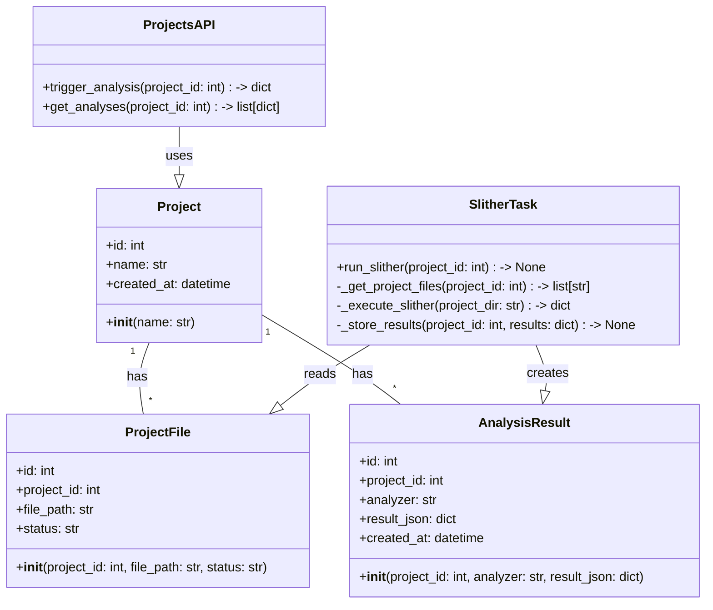
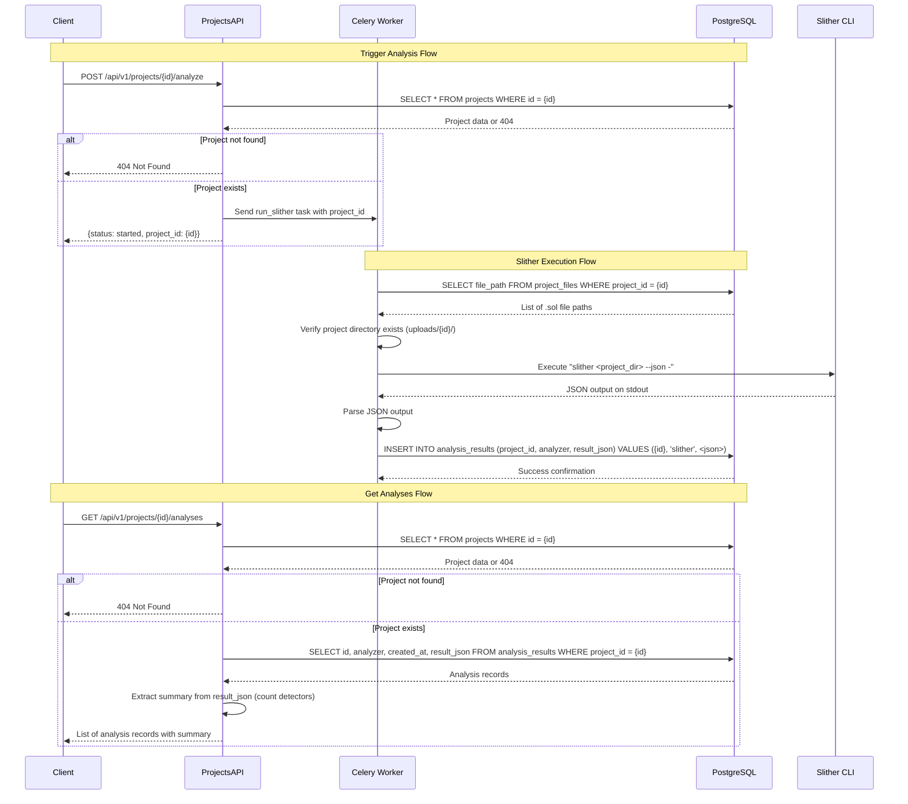

# Sprint 2 Design Document: Integrate Slither Static Analysis

## Implementation approach

We will integrate Slither static analysis into the existing SolidiGuard system by extending the current FastAPI/Celery architecture. The approach involves:

1. **New API endpoint** to trigger analysis via Celery task dispatch
2. **New Celery task** that executes Slither as a subprocess and stores raw output
3. **New database table** to store analysis results as JSONB without any processing
4. **Worker container updates** to install Slither and Solidity compiler dependencies

Key design decisions:
- Use direct subprocess execution within the Celery worker container (no Docker-in-Docker)
- Store complete Slither output as-is in JSONB column (no filtering or processing)
- Leverage existing SQLAlchemy async sessions for database operations
- Follow existing project structure and patterns from Sprint 1

## File list

- `backend/app/api/projects.py` - Add two new endpoints
- `backend/app/models.py` - Add AnalysisResult model
- `backend/app/tasks/analysis.py` - New Celery task for Slither execution
- `backend/alembic/versions/003_add_analysis_results_table.py` - Database migration
- `docker/Dockerfile` - Update to install slither-analyzer and solc
- `docker-compose.yml` - No changes needed (same worker service)
- `backend/app/tasks/__init__.py` - Update to include new task module

## Data structures and interfaces



## Program call flow



## Anything UNCLEAR

1. **Error handling for Slither failures**: The requirements specify storing raw output, but unclear if we should store stderr or error messages when Slither fails. We'll store whatever JSON output Slither produces, even if it contains error information.

2. **Solidity compiler version management**: Slither requires a compatible Solidity compiler. The design assumes a default version installed, but projects may require different versions. No mechanism specified for version detection or selection.

3. **Large project handling**: No specification for timeout limits or handling of very large projects that might exceed Slither's capabilities or memory limits.

4. **File path validation**: Unclear if we need to validate that the .sol files actually exist in the project directory before running Slither.

5. **Concurrent analysis**: No specification for handling multiple analysis requests for the same project simultaneously.

**Clarifications assumed**:
- Store complete Slither output including error states if any
- Use default Solidity compiler version (latest stable)
- No timeout handling beyond Celery defaults
- File paths from database are trusted to exist
- Allow concurrent analyses (each creates separate result record)
```